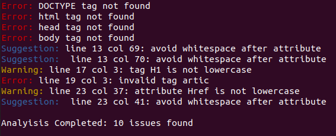

# HTML Linter - Ruby Capstone Project

> This is the [Capstone Project for the Ruby module](https://www.notion.so/Build-your-own-linter-b17a3c22f7b940c98ca1980250720769) of the Microverse program. The main goal of this project is to put into practice the concepts of **Methods**, **Classes**, **Modules** and **Testing.** in Ruby. 

## About the Project

As its name suggest, the HTML-linter enforces some basic HTML5 rules and good pratices recommended by w3school article [HTML Style Guide and Coding Conventions](https://www.w3schools.com/html/html5_syntax.asp).

### Rules sample

1. The document should contain the tags`<!DOCTYPE> <html> <head> <body> <title>`. Attributes are optional. The lint match only if the tag is at the start of a line or after whitespaces. 

**Good**
```
<!DOCTYPE html>
<html lang="en">
```

**Bad**
```
<!DOCTYPE html><html lang="en">
```
2. All tags and attribute must be in lowercase, except !DOCTYPE

**Good**
```
<html lang="en">
```

**Bad**
```
<Html LANG="en">
```
3. Tag exists and is a valid HTML5 tag

**Good**
```
<section>
```

**Bad**
```
<sections>
```
4. No whitspace between an attribute and its value if any

**Good**
```
<link rel="stylesheet" href="styles.css" />
```

**Bad**
```
<link rel=    "stylesheet" href   =  "styles.css" />
```

## Installation

### Prerequisites

- Ruby 1.9
- Install the Ruby Gem [Colorize](https://github.com/fazibear/colorize#install)

### Setup

- Download or clone this repository on your computer
- Select active folder: /html-Linter/bin in your console

### Usage

Type ruby main *path of your HTML file*

If your file does not comply with linter rules, the result will be something like this:



If there are no errors *analysis complete: 0 issues found* message will appear

## Authors

👤 **John Arboleda**

- Github: [John-Arboleda](https://github.com/John-Arboleda)
- Twitter: [John_J_Arboleda](https://twitter.com/John_J_Arboleda)
- Linkedin: [john-jairo-arboleda-castillo](https://www.linkedin.com/in/john-jairo-arboleda-castillo/)

## 🤝 Contributing

Contributions, issues, and feature requests are welcome!

Feel free to check the [issues page](issues/).

## Show your support

Give a ⭐️ if you like this project!

## 📝 License

This project is [MIT](lic.url) licensed.